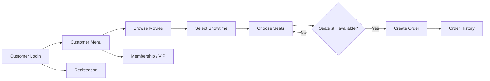
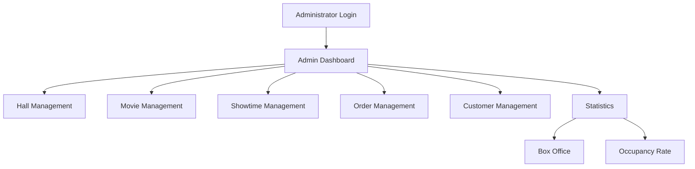
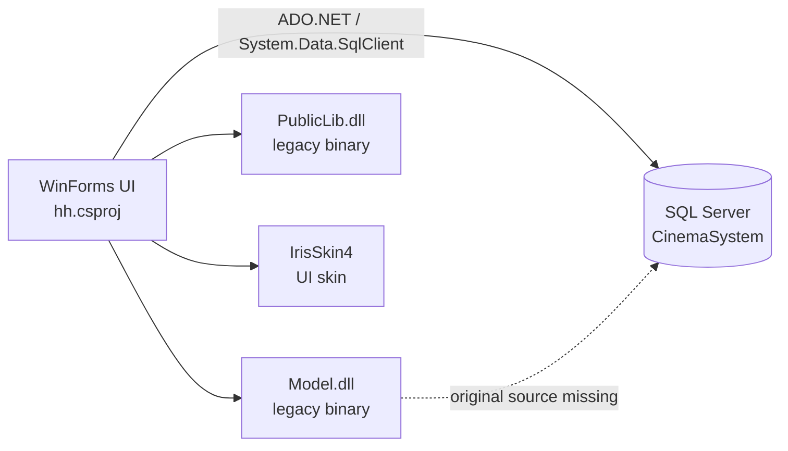
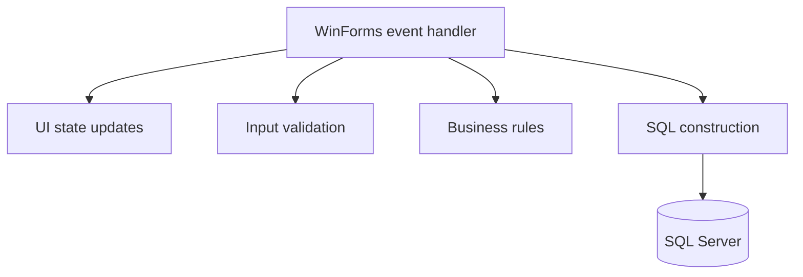
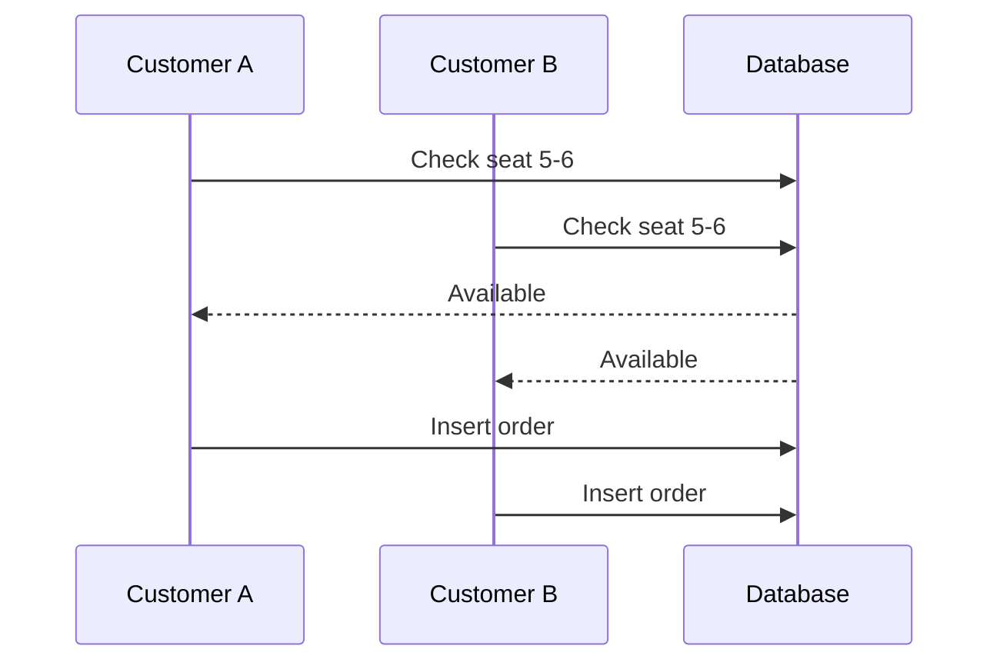

<div align="center">

# 🎬 Cinema Booking System

**A preserved undergraduate cinema booking system built with C# WinForms, .NET Framework 4.0 and SQL Server.**

[简体中文](./README.zh-CN.md) · [Technical Notes](./docs/PROJECT_NOTES.md)


</div>

---

## About

This repository preserves a **2020 undergraduate project**: a desktop cinema booking and management system implemented with Windows Forms and SQL Server.

It is intentionally kept as a **legacy portfolio project**, not rewritten to look like a modern production system. The original coding style, form-based structure and design trade-offs remain visible; the repository itself has been cleaned up so that another developer can understand what was built, how it was structured, and what is missing today.

> **Important:** this repository is currently suitable for **code reading and project review**, but it is **not fully clone-and-run reproducible** because the original SQL Server database assets are no longer available in the repository.

## At a glance

| Capability | Status | Notes |
| --- | :---: | --- |
| Browse source code | ✅ | Complete WinForms UI source is present |
| Open in Visual Studio | ✅ / ⚠️ | Requires a Windows environment capable of targeting .NET Framework 4.0 |
| Build the UI project | ⚠️ | Legacy binary dependencies are preserved under `lib/`, but the build has not been revalidated on a modern machine |
| Launch the full application | ❌ | Requires the original `CinemaSystem` database |
| Restore database from repository | ❌ | Schema, stored procedures and seed data are missing |
| Production use | ❌ | Historical educational project only |

## User workflow



## Administrator workflow



## Architecture



The checked-in project is primarily the **WinForms UI layer**. The original solution referenced sibling `Model` and `PublicLib` projects that were not included in the 2020 upload. Their historical compiled assemblies have been preserved under `lib/` so that the dependency structure is at least explicit.

## Features

### 👤 Customer

- Registration and login
- Movie and showtime browsing
- Dynamic seat-map generation
- Seat selection and availability checks
- Ticket booking
- Order history and order operations
- Membership / VIP handling

### 🛠️ Administrator

- Administrator login
- Cinema hall management
- Movie management
- Showtime management
- Order management
- Customer management
- Box-office statistics
- Occupancy-rate statistics

## Tech stack

| Area | Technology |
| --- | --- |
| Language | C# |
| UI | Windows Forms |
| Runtime | .NET Framework 4.0 Client Profile |
| Database | Microsoft SQL Server |
| Data access | ADO.NET / `System.Data.SqlClient` |
| UI skin | IrisSkin4 |
| Target | x86 / Windows |

## Project map

```text
.
├── Program.cs                 # Application entry point
├── Form1.cs                   # Customer login
├── Form2.cs                   # Customer menu
├── Form3.cs                   # Registration
├── Form4.cs                   # Movie / showtime selection
├── BuyTickets.cs              # Dynamic seats and ticket purchase
├── Form5.cs                   # Order history
├── Form6.cs                   # Membership / VIP
├── Form7.cs                   # Administrator login
├── Form8.cs                   # Administrator dashboard
├── Form9.cs                   # Hall management
├── Form10.cs                  # Movie management
├── Form11.cs                  # Showtime management
├── Form12.cs                  # Order management
├── Form13.cs                  # Customer management
├── Form14.cs                  # Statistics menu
├── Form15.cs / Form17.cs      # Statistics views
├── Properties/
├── lib/                       # Preserved legacy runtime dependencies
├── docs/
│   ├── PROJECT_NOTES.md
│   └── PROJECT_NOTES.zh-CN.md
├── app.config
├── CinemaBookingSystem.sln
└── hh.csproj
```

## Why it does not run immediately after cloning

The original application depends on a SQL Server database named `CinemaSystem`.

The historical database contained not only tables and data, but also database-side behavior such as stored procedures. For example, the login path invokes a stored procedure named `CheckCustomerLogin`.

The repository no longer contains:

- database schema
- stored procedures
- seed / demonstration data
- original database backup

Without those assets, the UI can be inspected and the legacy dependency structure can be reconstructed, but the complete application cannot be reproduced faithfully from this repository alone.

If the old database backup is ever recovered, it can be added later as a sanitized SQL restoration package.

## Local configuration

The committed `app.config` intentionally contains **no database password**.

Example using Windows authentication:

```xml
<add
  name="connStr"
  connectionString="Data Source=.;Initial Catalog=CinemaSystem;Integrated Security=True"
  providerName="System.Data.SqlClient" />
```

Do not commit real database credentials.

## Engineering retrospective

Looking back, the project has several characteristics typical of an early end-to-end application:



The main technical debt includes:

- UI, business logic and data access are tightly coupled.
- Some SQL statements are built through string concatenation rather than parameterized commands.
- Seat availability is checked before order insertion without a database transaction protecting the whole operation.
- Database connection and exception-handling logic is repeated across forms.
- There is no automated test suite.
- The database-side implementation is no longer available.

The booking flow is particularly instructive:



A production-grade implementation should protect this with a transaction and a database-level uniqueness constraint rather than relying only on an application-side availability check.

For a deeper review, see [docs/PROJECT_NOTES.md](./docs/PROJECT_NOTES.md).

## Historical note

This cleanup deliberately avoids rewriting the project into a modern architecture just to make the repository look newer.

The point is to preserve the project as a genuine snapshot of an undergraduate implementation while making its scope, strengths, limitations and technical lessons understandable to someone viewing it today.

## License

No open-source license has been selected for this repository. The source is publicly viewable on GitHub, but no additional reuse rights are granted by this repository unless a license is added later.
