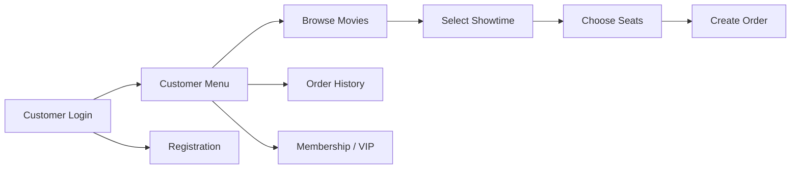
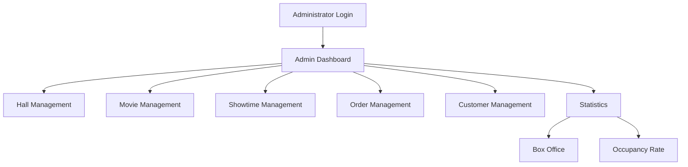
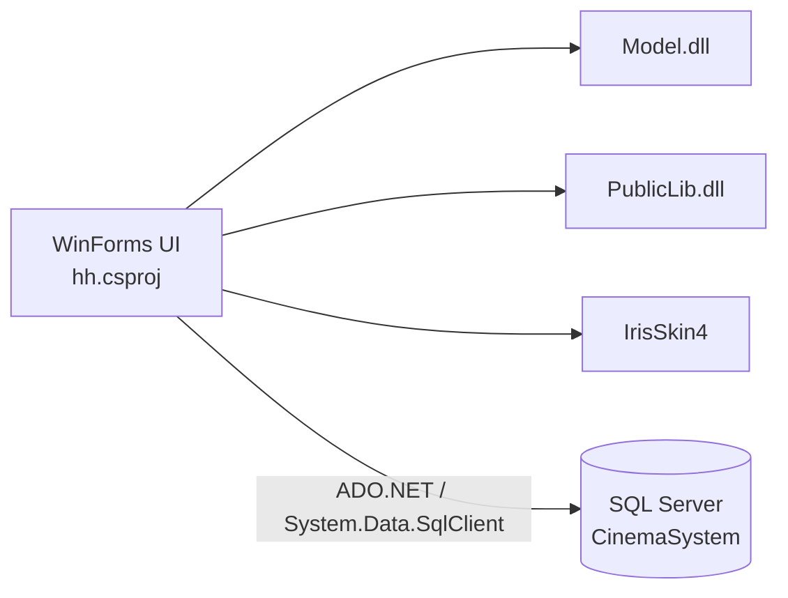

<div align="center">

# 🎬 Cinema Booking System

**Desktop cinema booking and management system built with C# WinForms, .NET Framework 4.0 and SQL Server.**

[简体中文](./README.zh-CN.md) · [Technical Notes](./docs/PROJECT_NOTES.md)


</div>

---

## Overview

This project was developed in 2020 as an undergraduate cinema booking system.

It provides customer-side ticket booking functions and administrator-side cinema management functions through a Windows Forms desktop application backed by SQL Server.

The repository currently contains the WinForms source code, project files, resources, and the binary dependencies that were available in the original repository. The original SQL Server database files and database scripts are not included.

## Repository status

| Item | Status | Notes |
| --- | :---: | --- |
| Source code | ✅ | WinForms source and resources are available |
| Visual Studio project | ✅ | `CinemaBookingSystem.sln` and `hh.csproj` are included |
| Legacy binary dependencies | ✅ | Required DLL / skin files are stored under `lib/` |
| Build verification | ⚠️ | Not re-tested on a current Windows / Visual Studio environment |
| Database schema | ❌ | Not available in the repository |
| Stored procedures | ❌ | Not available in the repository |
| Seed / sample data | ❌ | Not available in the repository |
| Full application runtime | ❌ | Requires the missing `CinemaSystem` database |

## Customer workflow



## Administrator workflow



## Project structure



The UI project originally referenced `Model` and `PublicLib` as sibling source projects outside this repository. Their source projects are not present in the current repository; compiled DLLs from the original project are stored under `lib/`.

## Features

### Customer

- Customer registration and login
- Movie and showtime browsing
- Dynamic seat-map generation
- Seat selection
- Seat availability checking
- Ticket booking
- Order history and order operations
- Membership / VIP handling

### Administrator

- Administrator login
- Cinema hall management
- Movie management
- Showtime management
- Order management
- Customer management
- Box-office statistics
- Occupancy-rate statistics

## Tech stack

| Area | Technology |
| --- | --- |
| Language | C# |
| UI | Windows Forms |
| Runtime | .NET Framework 4.0 Client Profile |
| Database | Microsoft SQL Server |
| Data access | ADO.NET / `System.Data.SqlClient` |
| UI skin | IrisSkin4 |
| Target platform | x86 / Windows |

## Source map

```text
.
├── Program.cs                 # Application entry point
├── Form1.cs                   # Customer login
├── Form2.cs                   # Customer menu
├── Form3.cs                   # Registration
├── Form4.cs                   # Movie / showtime selection
├── BuyTickets.cs              # Seat selection and ticket booking
├── Form5.cs                   # Order history
├── Form6.cs                   # Membership / VIP
├── Form7.cs                   # Administrator login
├── Form8.cs                   # Administrator dashboard
├── Form9.cs                   # Hall management
├── Form10.cs                  # Movie management
├── Form11.cs                  # Showtime management
├── Form12.cs                  # Order management
├── Form13.cs                  # Customer management
├── Form14.cs                  # Statistics menu
├── Form15.cs                  # Statistics view
├── Form16.cs
├── Form17.cs                  # Statistics view
├── Form18.cs
├── Properties/
├── lib/                       # Binary dependencies
├── docs/
│   ├── PROJECT_NOTES.md
│   └── PROJECT_NOTES.zh-CN.md
├── app.config
├── CinemaBookingSystem.sln
└── hh.csproj
```

## Database dependency

The application expects a SQL Server database named `CinemaSystem`.

Database access is performed both directly from WinForms code and through methods provided by the `Model` / `PublicLib` dependencies. The login flow, for example, calls the stored procedure `CheckCustomerLogin`.

The repository does not contain the original:

- table definitions
- stored procedures
- seed / sample data
- database backup

As a result, cloning the repository is sufficient for source-code inspection, but not for reproducing the complete application runtime.

## Local configuration

The committed `app.config` contains a connection-string template using Windows authentication:

```xml
<add
  name="connStr"
  connectionString="Data Source=.;Initial Catalog=CinemaSystem;Integrated Security=True"
  providerName="System.Data.SqlClient" />
```

Change the connection string locally if a compatible `CinemaSystem` database is available.

## Implementation notes

The source currently contains the following implementation patterns:

- WinForms event handlers perform UI updates, validation, database access, and business operations.
- Several SQL statements are assembled by string concatenation.
- Database connection code appears in multiple forms.
- Seat availability is checked before order insertion in the application layer.
- No automated test project is included in the repository.

More details are listed in [docs/PROJECT_NOTES.md](./docs/PROJECT_NOTES.md).

## License

No open-source license file is currently included in the repository.
