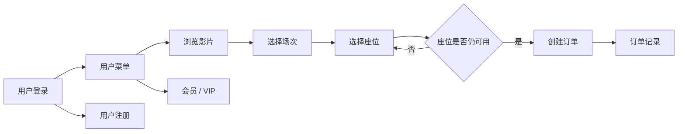
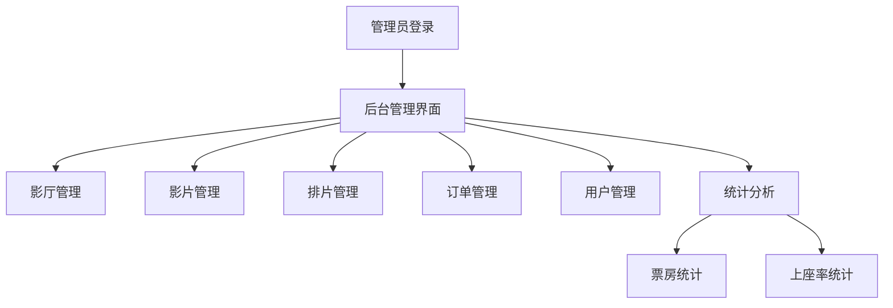
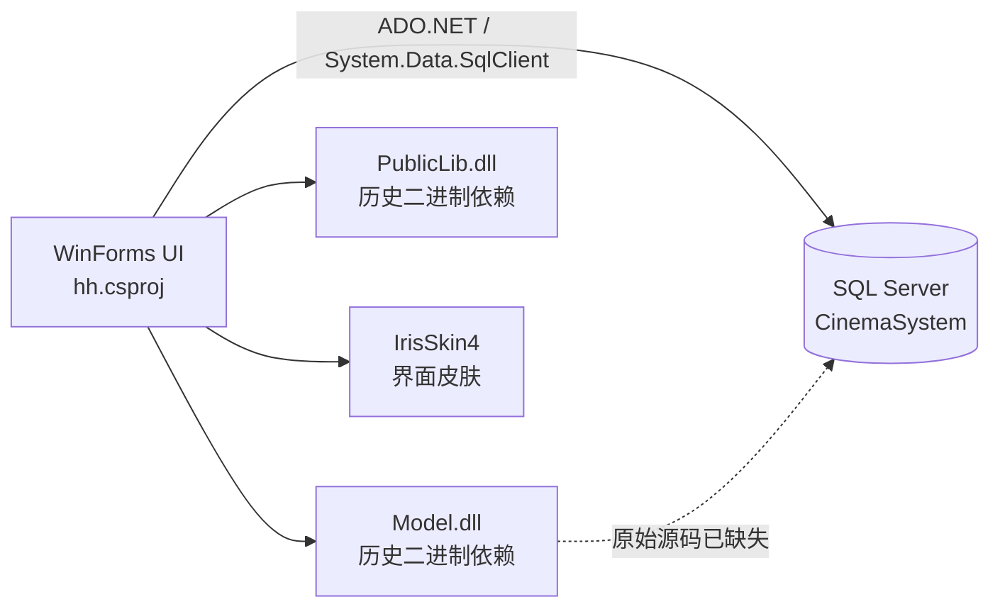
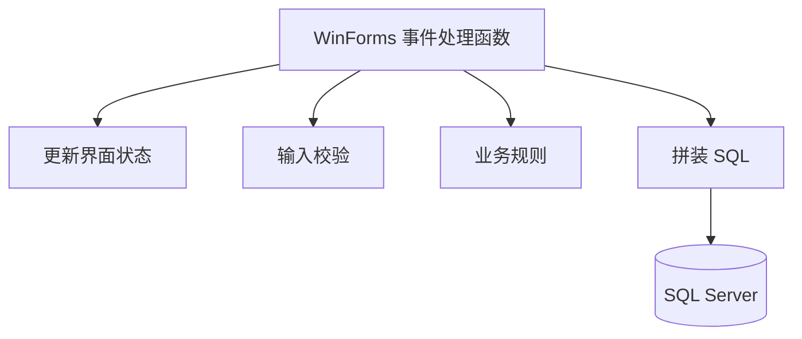
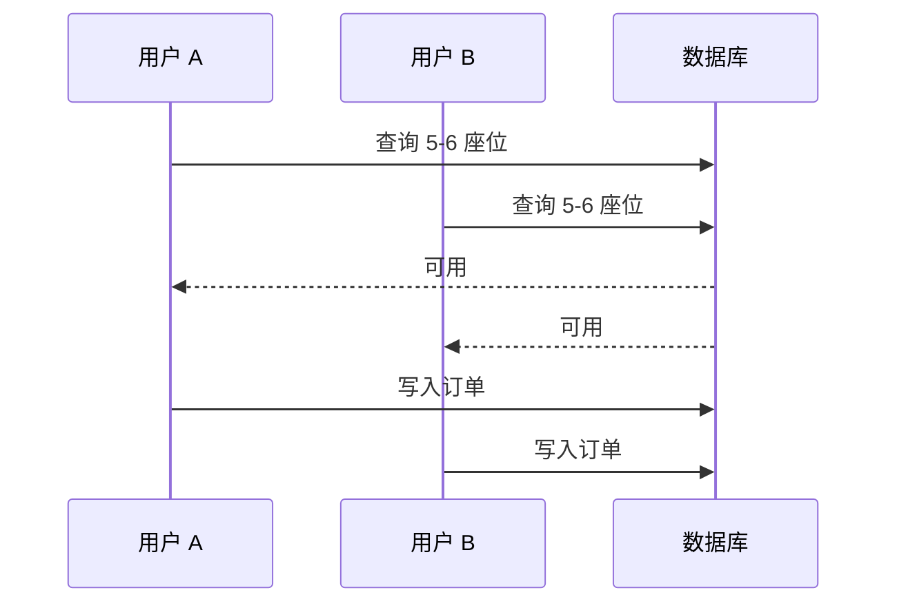

<div align="center">

# 🎬 电影院订票系统

**一个使用 C# WinForms、.NET Framework 4.0 与 SQL Server 实现并保留下来的本科课程项目。**

[English](./README.md) · [技术说明](./docs/PROJECT_NOTES.zh-CN.md)


</div>

---

## 项目说明

这是一个保留至今的 **2020 年本科阶段项目**：使用 Windows Forms 与 SQL Server 实现的桌面端电影院订票与后台管理系统。

目前将它定位为一个 **legacy portfolio project（历史作品集项目）**，而不是把旧代码重新包装成仿佛 2026 年才写出来的现代工程。原始代码风格、窗体组织方式和当时的设计取舍基本保留，只对 GitHub 仓库本身进行了整理，让今天的读者能够快速理解：**当时做了什么、项目如何组织、现在还缺什么。**

> **重要：** 当前仓库适合用于**代码阅读、项目审阅和作品展示**，但由于原始 SQL Server 数据库资产已经不在仓库中，因此目前**不具备完整的 clone-and-run 可复现性**。

## 当前可用状态

| 能力 | 状态 | 说明 |
| --- | :---: | --- |
| 阅读源码 | ✅ | WinForms UI 源码基本完整 |
| 使用 Visual Studio 打开 | ✅ / ⚠️ | 需要能够支持 .NET Framework 4.0 的 Windows 开发环境 |
| 编译 UI 工程 | ⚠️ | 历史二进制依赖已整理到 `lib/`，但尚未在现代环境重新验证 |
| 启动完整系统 | ❌ | 依赖原始 `CinemaSystem` 数据库 |
| 从仓库恢复数据库 | ❌ | 缺少 schema、存储过程与 seed data |
| 用于生产环境 | ❌ | 仅作为历史学习与作品集项目 |

## 用户端流程



## 管理员端流程



## 项目架构



当前仓库主要保存的是 **WinForms UI 层**。原始工程曾引用仓库之外的 `Model` 与 `PublicLib` 两个兄弟项目，但 2020 年上传时没有把它们的源码一起提交。历史编译得到的 DLL 仍然存在，因此整理后将必要依赖集中放到了 `lib/` 中，使依赖关系至少变得明确和可追踪。

## 功能

### 👤 用户端

- 用户注册与登录
- 浏览影片及排片
- 根据影厅行列动态生成座位图
- 选座与座位占用检查
- 购票
- 订单记录及相关操作
- 会员 / VIP 办理

### 🛠️ 管理员端

- 管理员登录
- 影厅管理
- 影片管理
- 排片管理
- 订单管理
- 用户管理
- 票房统计
- 上座率统计

## 技术栈

| 模块 | 技术 |
| --- | --- |
| 编程语言 | C# |
| UI | Windows Forms |
| 运行时 | .NET Framework 4.0 Client Profile |
| 数据库 | Microsoft SQL Server |
| 数据访问 | ADO.NET / `System.Data.SqlClient` |
| UI 皮肤 | IrisSkin4 |
| 目标平台 | x86 / Windows |

## 项目结构

```text
.
├── Program.cs                 # 程序入口
├── Form1.cs                   # 用户登录
├── Form2.cs                   # 用户菜单
├── Form3.cs                   # 用户注册
├── Form4.cs                   # 影片 / 排片选择
├── BuyTickets.cs              # 动态座位与购票
├── Form5.cs                   # 订单记录
├── Form6.cs                   # 会员 / VIP
├── Form7.cs                   # 管理员登录
├── Form8.cs                   # 后台管理主界面
├── Form9.cs                   # 影厅管理
├── Form10.cs                  # 影片管理
├── Form11.cs                  # 排片管理
├── Form12.cs                  # 订单管理
├── Form13.cs                  # 用户管理
├── Form14.cs                  # 统计菜单
├── Form15.cs / Form17.cs      # 统计视图
├── Properties/
├── lib/                       # 保留的历史运行依赖
├── docs/
│   ├── PROJECT_NOTES.md
│   └── PROJECT_NOTES.zh-CN.md
├── app.config
├── CinemaBookingSystem.sln
└── hh.csproj
```

## 为什么 clone 后不能直接完整运行？

原始程序依赖一个名为 `CinemaSystem` 的 SQL Server 数据库。

这个数据库不仅保存数据表和数据，还承载了一部分数据库侧逻辑。例如用户登录流程会调用名为 `CheckCustomerLogin` 的存储过程。

而当前仓库已经没有：

- 数据库表结构
- 存储过程
- 演示 / 初始化数据
- 原始数据库备份

因此，目前可以恢复和阅读 UI 项目、查看程序逻辑和依赖关系，但**无法仅依靠本仓库忠实重建完整运行环境**。

如果未来从旧电脑中重新找到数据库备份，可以再将其整理成脱敏后的 SQL 恢复包补进仓库。

## 本地配置

当前提交的 `app.config` **不包含数据库密码**。

使用 Windows 身份认证的示例：

```xml
<add
  name="connStr"
  connectionString="Data Source=.;Initial Catalog=CinemaSystem;Integrated Security=True"
  providerName="System.Data.SqlClient" />
```

真实数据库账号、密码等敏感信息不应提交到 Git 仓库。

## 工程回顾

今天回头看，这个项目包含不少典型的早期端到端应用特征：



主要技术债包括：

- UI、业务逻辑与数据访问高度耦合。
- 部分 SQL 通过字符串拼接构造，而非统一使用参数化查询。
- 购票过程先检查座位、随后再写入订单，整个过程没有数据库事务保护。
- 数据库连接、异常处理等逻辑在多个 Form 中重复出现。
- 没有自动化测试。
- 数据库侧实现已经缺失。

其中“座位并发”是一个很典型的软件工程问题：



如果用于生产环境，正确做法应当依靠**数据库事务 + 唯一性约束**保护购票操作，而不是只依赖应用层的 `CheckSeat()`。

更详细的技术回顾见：[docs/PROJECT_NOTES.zh-CN.md](./docs/PROJECT_NOTES.zh-CN.md)。

## 历史说明

本次整理刻意没有把旧项目大规模重构成现代架构。

它的价值就在于真实保留了本科阶段的一次完整工程实践：既能看到当时已经完成的功能，也能清楚看到今天回头审视时可以改进的地方。

相比把历史代码全部重写，这种状态更适合作为一个长期作品集和技术成长记录。

## License

当前仓库没有选择开源许可证。代码可以在 GitHub 上公开查看，但在后续明确加入许可证之前，本仓库并未主动授予额外的复制、修改或再分发权利。
