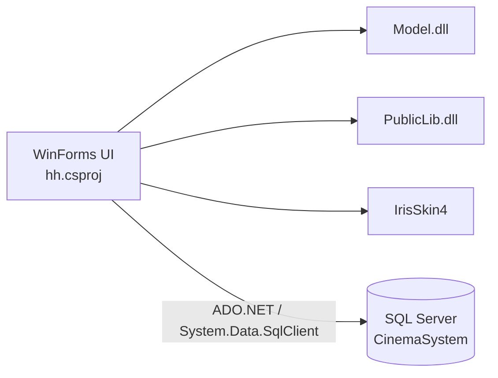

<div align="center">

# 🎬 电影院订票系统

**基于 C# WinForms、.NET Framework 4.0 和 SQL Server 的桌面端电影院订票与管理系统。**

[English](./README.md) · [技术说明](./docs/PROJECT_NOTES.zh-CN.md)


</div>

---

## 项目简介

该项目完成于 2020 年本科阶段，用于实现电影院用户订票和管理员后台管理功能。

程序采用 Windows Forms 构建桌面界面，使用 SQL Server 保存业务数据。当前仓库包含 WinForms 源码、工程文件、资源文件，以及原仓库中能够找到的二进制依赖。

原始 SQL Server 数据库文件和数据库脚本目前不在仓库中。

## 仓库当前状态

| 项目 | 状态 | 说明 |
| --- | :---: | --- |
| 源代码 | ✅ | WinForms 源码和资源文件已包含 |
| Visual Studio 工程 | ✅ | 包含 `CinemaBookingSystem.sln` 和 `hh.csproj` |
| 二进制依赖 | ✅ | 现有 DLL / skin 文件整理在 `lib/` |
| 编译验证 | ⚠️ | 尚未在当前 Windows / Visual Studio 环境重新编译验证 |
| 数据库表结构 | ❌ | 仓库中不存在 |
| 存储过程 | ❌ | 仓库中不存在 |
| 初始化 / 示例数据 | ❌ | 仓库中不存在 |
| 完整运行 | ❌ | 需要缺失的 `CinemaSystem` 数据库 |

## 用户端流程


## 管理员端流程


## 项目结构



UI 工程原本通过 ProjectReference 引用了仓库之外的 `Model` 和 `PublicLib` 两个兄弟项目。当前仓库中没有这两个项目的源码；原项目遗留的编译 DLL 已整理到 `lib/`。

## 功能

### 用户端

- 用户注册与登录
- 浏览影片及排片
- 根据影厅行列生成座位图
- 选择座位
- 检查座位占用状态
- 购票
- 订单记录及相关操作
- 会员 / VIP 办理

### 管理员端

- 管理员登录
- 影厅管理
- 影片管理
- 排片管理
- 订单管理
- 用户管理
- 票房统计
- 上座率统计

## 技术栈

| 模块 | 技术 |
| --- | --- |
| 编程语言 | C# |
| UI | Windows Forms |
| 运行时 | .NET Framework 4.0 Client Profile |
| 数据库 | Microsoft SQL Server |
| 数据访问 | ADO.NET / `System.Data.SqlClient` |
| UI 皮肤 | IrisSkin4 |
| 目标平台 | x86 / Windows |

## 源码目录

```text
.
├── Program.cs                 # 程序入口
├── Form1.cs                   # 用户登录
├── Form2.cs                   # 用户菜单
├── Form3.cs                   # 用户注册
├── Form4.cs                   # 影片 / 排片选择
├── BuyTickets.cs              # 选座与购票
├── Form5.cs                   # 订单记录
├── Form6.cs                   # 会员 / VIP
├── Form7.cs                   # 管理员登录
├── Form8.cs                   # 后台管理主界面
├── Form9.cs                   # 影厅管理
├── Form10.cs                  # 影片管理
├── Form11.cs                  # 排片管理
├── Form12.cs                  # 订单管理
├── Form13.cs                  # 用户管理
├── Form14.cs                  # 统计菜单
├── Form15.cs                  # 统计视图
├── Form16.cs
├── Form17.cs                  # 统计视图
├── Form18.cs
├── Properties/
├── lib/                       # 二进制依赖
├── docs/
│   ├── PROJECT_NOTES.md
│   └── PROJECT_NOTES.zh-CN.md
├── app.config
├── CinemaBookingSystem.sln
└── hh.csproj
```

## 数据库依赖

程序依赖名为 `CinemaSystem` 的 SQL Server 数据库。

部分数据库操作直接写在 WinForms 代码中，部分操作通过 `Model` / `PublicLib` 中的方法完成。例如，用户登录流程会调用存储过程 `CheckCustomerLogin`。

当前仓库不包含原始：

- 数据表定义
- 存储过程
- 初始化 / 示例数据
- 数据库备份

因此，clone 当前仓库后可以查看源码和工程结构，但无法仅依赖仓库内容恢复完整运行环境。

## 本地配置

当前 `app.config` 使用 Windows 身份认证作为连接字符串模板：

```xml
<add
  name="connStr"
  connectionString="Data Source=.;Initial Catalog=CinemaSystem;Integrated Security=True"
  providerName="System.Data.SqlClient" />
```

如果存在兼容的 `CinemaSystem` 数据库，可以在本地修改连接字符串。

## 实现说明

当前源码中可以确认以下实现方式：

- WinForms 事件处理函数同时包含界面更新、输入校验、数据库访问和业务操作。
- 部分 SQL 语句通过字符串拼接构造。
- 多个 Form 分别包含数据库连接相关代码。
- 购票流程在应用层先检查座位状态，再执行订单写入。
- 仓库中没有自动化测试项目。

更详细的源码结构说明见：[docs/PROJECT_NOTES.zh-CN.md](./docs/PROJECT_NOTES.zh-CN.md)。

## License

当前仓库未包含开源许可证文件。
